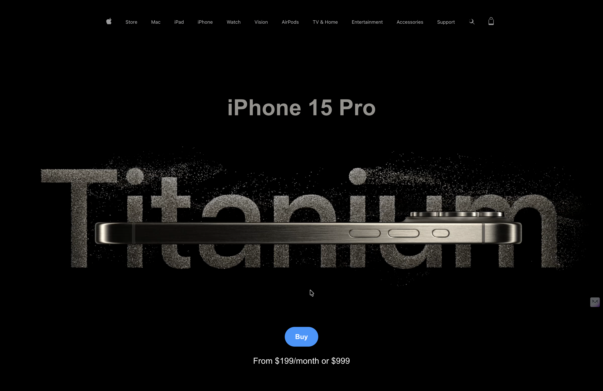

# 🍎 iPhone 15 Pro — Animated Website Clone

A visually rich, animated clone of Apple's iPhone 15 Pro product page, built with modern web technologies and deployed on Vercel.

🔗 **Live Demo:** [apple-animated-website.vercel.app](https://apple-animated-website.vercel.app/)

---

## 📸 Preview

> Inspired by Apple's iconic product page design — featuring scroll-driven animations, video heroes, and immersive product storytelling.



---

## ✨ Features

- 🎬 **Hero video section** with autoplay background video
- 🔩 **Titanium design showcase** with animated image reveals
- 🎮 **A17 Pro chip gaming segment** with scroll-triggered effects
- 📱 **Responsive layout** mimicking Apple's clean aesthetic
- 🧭 **Apple-style navigation bar** with product category links
- 🎥 **Embedded product videos** for explore and frame sections
- 💅 Smooth scroll animations and transitions throughout

---

## 🛠️ Tech Stack

| Technology | Purpose |
|---|---|
| **HTML / CSS** | Structure & styling |
| **JavaScript** | Interactivity & animations |
| **GSAP** *(likely)* | Scroll-driven animations |
| **Vercel** | Hosting & deployment |

> *(Update this table to match your actual stack)*

---

## 🚀 Getting Started

### Prerequisites

- Node.js `v18+`
- npm or yarn

### Installation

```bash
# Clone the repository
git clone https://github.com/your-username/apple-animated-website.git

# Navigate into the project
cd apple-animated-website

# Install dependencies
npm install
```

### Running Locally

```bash
npm run dev
```

Open [http://localhost:3000](http://localhost:3000) in your browser.

### Building for Production

```bash
npm run build
npm run preview
```

---

## 🌐 Deployment

This project is deployed on **Vercel**. To deploy your own fork:

1. Push your code to GitHub
2. Import the repo at [vercel.com/new](https://vercel.com/new)
3. Vercel auto-detects the framework and deploys instantly

---

## ⚠️ Disclaimer

This project is a **fan-made clone** built for educational and portfolio purposes only. All product names, images, videos, and branding belong to **Apple Inc.** This project is not affiliated with or endorsed by Apple.

---

## 📄 License

This project is open source under the [MIT License](LICENSE).

---

## 🙌 Acknowledgements

- Inspired by [Apple's official iPhone 15 Pro page](https://www.apple.com/iphone-15-pro/)
- Assets sourced from Apple's public marketing materials *(for educational use only)*